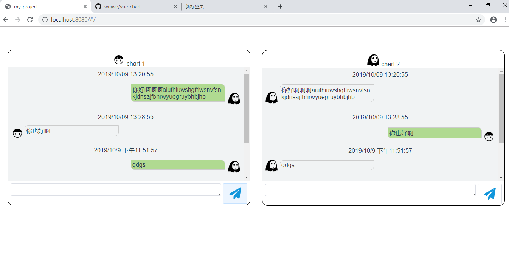

# my-project

## 图片演示

## 如何运行
npm版本需要大于3.0
检查npm版本
`npm -v`

升级npm
`npm install npm -g`

安装VUE
`npm install vue`

下载本资源
`git clone https://github.com/wuyve/vue-chart.git`

进入到项目中
`cd chart`

安装依赖包
`npm install`

运行项目
`npm start` 或 `npm run dev`

在浏览器打开`http://localhost:8080/#/`

## 项目功能
本项目为聊天室的基本功能：
1. 两个单人聊天框，暂称为chart1和chart2；
2. chart1能显示A发的消息和A接受的消息，A发出的消息的气泡框为草绿色；
3. chart2能显示B发送的消息和B接受的消息，B发出的消息的气泡框为草绿色；
4. 己方发送消息时，另一方的聊天框能接收到消息，并默认显示到聊天框最底部；
5. 发送/接收消息时，会显示时间、发送人的头像、以及消息气泡；
5. 按键盘`enter`键可以直接发送消息，当然，点击输入框旁边的【发送】按钮也可以发送消息；
6. 输入框无输入内容时，【发送】按钮为禁用状态
6. 点击按钮发送信息是，不能发送空消息；
7. 发送消息的长度不能超过3420字；
8. 按`ctrl+enter`键可以换行；
